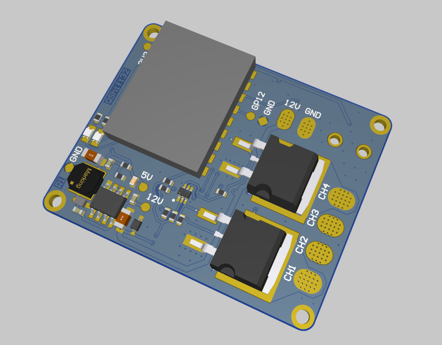

# QShift32 - ESP32 based timing retard quickshifter module for motorcycles
This project is basically a big revision of my other project "quickshiftuino".
The differences are pretty big though, so I decided to create a new repository.

"quickshiftuino" had 2 channels that could cut the power to the ignition coils on the high side (P-Mos).
That topology works great, is fairly simple and reliable, but doesn't allow for more complex features.

"QShift32" uses all the thoroughly tested sub-circuits of "quickshiftuino" except the power switching components.
It instead offers 4 independent channels switched by IGBTs on the low side.
They can withstand high voltages and high current and are configured to pull down the low side of the ignition coil.

## New possibilities
- RPM measurement even during power cut
- Precise dwell time measurement for each channel
- Ignition timing retard instead of ignition coil power cut to allow clutchless shifting
- Smooth control over engine power transitions -> extremely smooth shifts
- During upshift period fuel gets ignited in the exhaust instead of remaining unburnt (-> pops and flames)
- Pit limiter and launch control possible in the future

## Development progress
### 28.12.2024
- R1 pcb assembled
- first successful tests of retarding ignition pulses (only on the bench)

## Next steps
- Debug code on the bench to prevent coils from burning
- Build a new wiring harness to connect to the bike
- Do some test runs before adding the web configuration interface and other confort features of quickshiftuino
