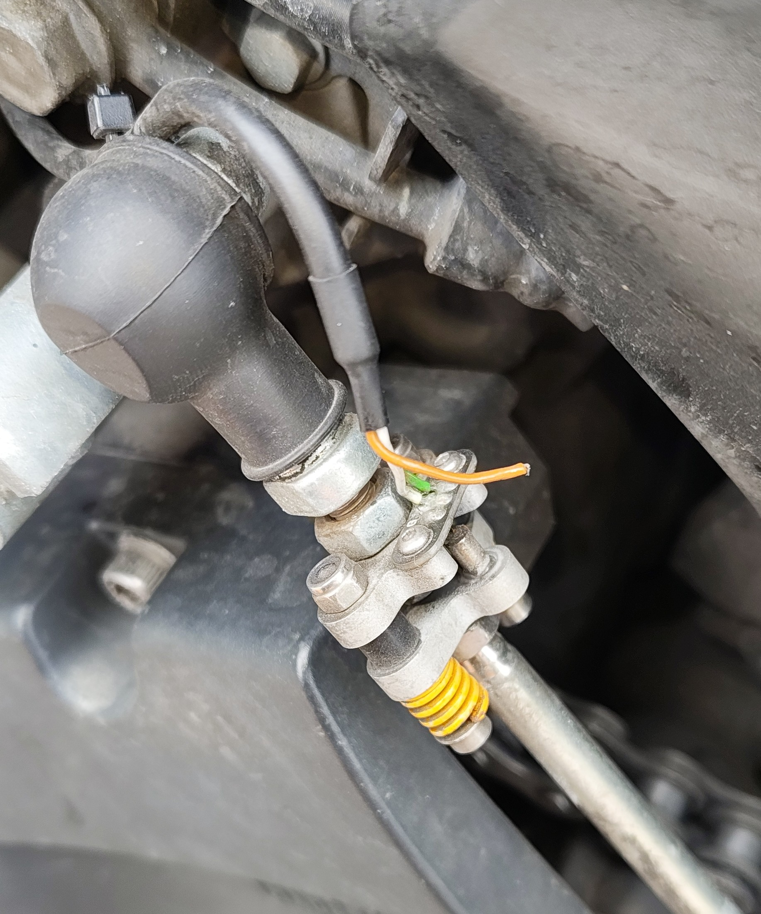
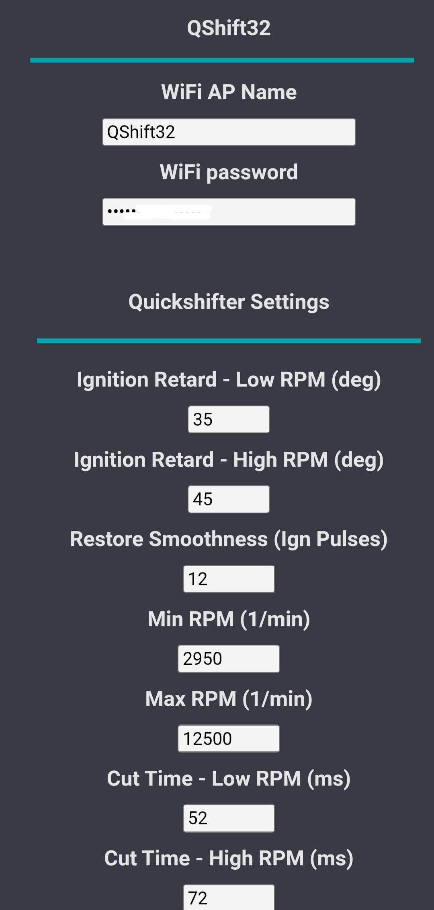
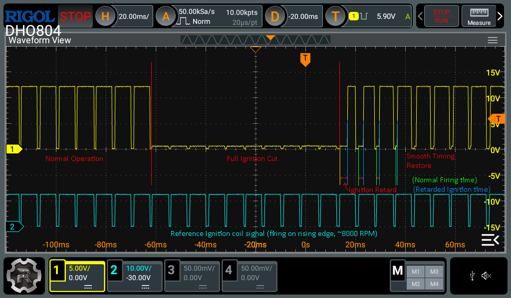

# QShift32 - ESP32 based timing retard quickshifter module for motorcycles
This project is basically a new revision of my other project "quickshiftuino".
The differences are pretty big though, so I decided to create a new repository.

"**quickshiftuino**" had 2 channels that could cut the power to the ignition coils on the high side (P-Mos).
That topology works great, is fairly simple and reliable, but doesn't allow for more complex features.

"**QShift32**" uses all the thoroughly tested sub-circuits of "quickshiftuino" except the power switching components.
It instead offers 4 independent channels switched by IGBTs on the low side.
They can withstand high voltages and high current and are configured to pull down the low side of the ignition coil.
This can either be used to fully prevent sparks from firing or delay them by a precise time to achieve an ignition retard.

[**Demonstration Video**](https://www.youtube.com/watch?v=TwFzDqyh4EY)

[**Latest feature development: staggered cut**](https://youtu.be/_X9n1uwMxqk)

R1 PCB 3D model:

## New possibilities
- Either ignition timing retard or full spark cut to allow clutchless shifting
- Ignition timing retard will smoothly go back to normal operation after shift is done (no jerky movement, less gearbox wear)
- Smooth control over engine power transitions -> extremely smooth shifts (upshifts while leaning and accelerating possible)
- RPM measurement even during power cut (not during full spark cut, only ignition retard)
- During upshift period fuel gets ignited in the exhaust instead of remaining unburnt (controllable pops and flame strength)
- Pit limiter and launch control (RPM limiter) with spark cut and ignition retard (soft limiter or hard limiter with pops and flames)
- Precise dwell time and time per revolution measurement for each channel (1 µs precision)
- Expandable to support handlebar buttons, gear indicator, shift light (not implemented yet), etc.

My DIY hall based pressure sensor with CNC aluminium parts and 3d printed hotbed springs (die cast springs)
(Ignore the broken wire please ;) )

## Easy configuration
Use any smartphone to connect to the WiFi Access Point opened by QShift32.
IP Adress 192.168.4.1 shows the configuration options.
192.168.4.1/debug.html shows a few internal debug values that can help setting up the config and finding possible errors (mostly needed for development).

## Precise control over ignition coils
The **bottom graph** shows an unmodified reference ignition coil signal as produced by the engine ECU.

The **top graph** shows the modified ignition pulse, controlled by QShift32.
It prevents ignition pulses for a set time and then slowly reintroduces engine power output by ramping down the ignition retard angle.

## Next steps (high to low priority)
- Upload more pictures and write easy-to-follow build instructions and documentation
- Improve code structure, efficiency and write more code documentation
- Try to reduce the amount of configuration options for simplicity
- Find a way to reliably measure variable reluctance wheel speed sensors (only 0-5V hall type working right now)
- Design a case that holds the PCB and connectors (ideally somewhat water splash proof)
- Find a way of controlling multiple channels simultaneously with a single timer (very low priority)

The pulse measurement and IGBT switching schematic and some parts of the code were inspired by the "DIY Quickshifter" series by Gil Vargas on YouTube.
He explains all the steps in great detail.
